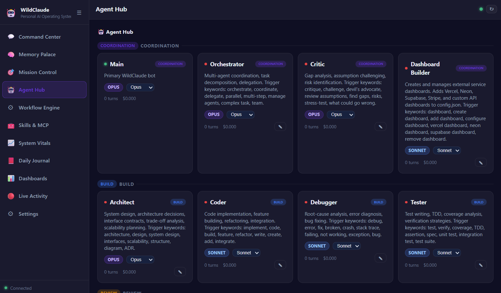

# WildClaude

**Personal AI Operating System built on Claude.**

Lightweight enough to run on a Raspberry Pi. Powerful enough to manage your entire digital life.

Primary interface: **Telegram**. Secondary: **Web Dashboard** (11 modules, dark mode). Tertiary: **CLI**.

## Why WildClaude?

When Anthropic restricted third-party access to Claude, tools like OpenClaw that depended on proxy architectures broke. WildClaude was built as a direct replacement:

- **Uses your Claude subscription** (Pro/Max) via `claude -p` — no separate API key needed
- **Also supports Anthropic API** — set `ANTHROPIC_API_KEY` for pay-per-use mode
- **Multi-model routing** — Opus for complex reasoning, Sonnet for routine tasks, Haiku for classification
- **Everything OpenClaw had** — Telegram, memory, scheduling, agents, dashboards — plus much more

## Features

### AI & Agents
- **Multi-model routing** — Haiku classifies each message, routes to Opus/Sonnet/Haiku automatically
- **17 specialized agents** across 5 lanes (Build, Review, Domain, Coordination, Life)
- **Concurrent messages** — fast-path Haiku sidecar for quick responses while Opus works
- **Ralph autonomous loop** — give it a goal, it decomposes and executes iteratively
- **Self-evolution** — create agents and skills via conversation, git-tracked

### Memory & Context
- **Fully local memory** — no external APIs, pattern-based extraction, SQLite FTS5 + markdown persistence
- **Self-reflection** — detects corrections, logs lessons, injects into future prompts
- **Session continuity** — auto-generates handoff summaries before `/newchat`, inject with `/respin`

### Personalization
- **Personality customization** — 6 presets (default, professional, casual, coach, debug, creative), hot-reload
- **Multilingual onboarding** — English, Italian, Spanish. Choose your bot's name and personality
- **Life management** — `/morning` briefings, `/evening` reviews, `/goals`, `/focus`, `/journal`, `/review`

### Integrations
- **31 MCP server integrations** (Notion, GitHub, Slack, Vercel, Neon, Stripe, Supabase...)
- **External dashboards** — connect Vercel, Neon, GitHub, Stripe, Cloudflare, Sentry with purpose-built UIs
- **Import from OpenClaw** — memories, API keys, MCP configs, cron jobs, agent metadata
- **Voice** — Groq Whisper (STT) + ElevenLabs (TTS)
- **WhatsApp & Slack bridges**

### Infrastructure
- **Encrypted secrets manager** — AES-256-GCM, manage from dashboard or Telegram
- **Dark-mode dashboard** with 11 modules and real-time SSE updates
- **Security** — PIN lock, idle auto-lock, emergency kill phrase, full audit log
- **Lightweight** — runs anywhere from a PC to a Raspberry Pi
- **Data separation** — code in repo, all user data in `~/.wild-claude-pi/`

## Quick Start

**Linux / macOS / Raspberry Pi:**
```bash
git clone https://github.com/rsalvagio92/WildClaude.git
cd WildClaude
bash scripts/bootstrap.sh
```

**Windows (PowerShell):**
```powershell
git clone https://github.com/rsalvagio92/WildClaude.git
cd WildClaude
powershell -ExecutionPolicy Bypass -File scripts\bootstrap.ps1
```

The bootstrap script handles everything:

1. Checks and installs **Node.js 22**, **Claude CLI**
2. Opens Claude login (browser auth with your Anthropic account)
3. **AI backend choice**: Claude subscription or Anthropic API key
4. **Interface mode**: Telegram + Dashboard, Dashboard only, or skip
5. If Telegram: asks for bot token, auto-detects your chat ID
6. Installs dependencies, builds, launches

On first launch, an interactive **onboarding wizard** runs in the terminal:

1. **Language selection** — English, Italiano, Español
2. **AI backend** — Subscription (Claude CLI) or API key
3. **Import detection** — finds OpenClaw, claude-mem, bOS, Claude Code data
4. **Profile questions** — name, location, languages, work style, goals, projects
5. **Bot personalization** — choose a name (default: "WildClaude") and personality preset
6. **Dashboard token** — auto-generated for web access

After onboarding, the bot starts and is ready to use in Telegram.

## Architecture

```
Telegram / Dashboard / CLI
        │
   Haiku Router (classify → Opus / Sonnet / Haiku)
        │
   17 Agents (5 lanes: Build, Review, Domain, Coordination, Life)
        │
   Claude CLI (claude -p) → subscription auth
   OR Anthropic SDK → API key
        │
   Memory (SQLite FTS5 + .md) │ Secrets (AES-256-GCM) │ Life Kernels (.md)
```

**Data separation:** Code lives in the repo. All user data lives in `~/.wild-claude-pi/` — memories, secrets, custom agents/skills, life context, config. `git pull` never touches your data.

## Dashboard

11 modules, dark mode, real-time SSE updates, accessible from your local network.



| Module | What it does |
|--------|-------------|
| Command Center | Chat with the bot from browser |
| Memory Palace | Search, browse, pin/delete memories |
| Mission Control | Goals, projects, task management |
| Agent Hub | 17 agents grouped by lane, edit system prompts |
| Workflow Engine | Scheduled tasks, cron management |
| Skills & MCP | Manage skills + install/remove 31 MCP servers |
| System Vitals | CPU, RAM, disk, temperature, network, costs |
| Daily Journal | Auto-generated entries from reviews |
| External Dashboards | Vercel, GitHub, Neon, Supabase, Stripe, Cloudflare, Sentry |
| Live Activity | Real-time stream of all bot activity |
| Settings | Personality, bot identity, secrets, profile, import |

## Agents

17 agents across 5 lanes:

| Lane | Agents | Model |
|------|--------|-------|
| **Build** | `@architect`, `@coder`, `@debugger`, `@tester` | Opus / Sonnet |
| **Review** | `@code-reviewer`, `@security-reviewer` | Opus / Sonnet |
| **Domain** | `@researcher`, `@writer`, `@data-analyst` | Sonnet |
| **Coordination** | `@orchestrator`, `@critic`, `@dashboard-builder` | Opus / Sonnet |
| **Life** | `@coach`, `@organizer`, `@finance`, `@health`, `@learner` | Opus / Sonnet / Haiku |

Use: `@coder implement the auth middleware` or `/delegate coder implement the auth middleware`.

## Coming from OpenClaw?

WildClaude imports your OpenClaw data automatically:

```
/import all
```

This brings over: memories, API keys (GROQ, BRAVE, OPENAI), MCP servers, cron jobs, agent metadata, and workspace files.

Also imports from: ClaudeClaw, claude-mem, bOS, Claude Code, and generic markdown/JSON/SQLite files.

## CLI

WildClaude includes a unified CLI. From the project root:

```bash
./wildclaude help          # Linux/macOS/Pi
.\wildclaude help          # Windows
```

Install globally so you can run `wildclaude` from anywhere:

```bash
./wildclaude setup         # Linux: symlinks to /usr/local/bin
.\wildclaude setup         # Windows: copies to WindowsApps or adds to PATH
```

| Command | Description |
|---------|-------------|
| `wildclaude setup` | Install CLI globally (run from anywhere) |
| `wildclaude install` | Clone and set up WildClaude |
| `wildclaude start` | Start WildClaude |
| `wildclaude stop` | Stop WildClaude |
| `wildclaude restart` | Restart |
| `wildclaude status` | Show status, config, versions |
| `wildclaude upgrade` | Pull latest, rebuild, restart |
| `wildclaude logs [-f]` | Show logs (-f to follow) |
| `wildclaude config` | Edit .env |
| `wildclaude dashboard` | Open dashboard in browser |
| `wildclaude reset` | Reset user data (re-run onboarding) |
| `wildclaude service install` | Install systemd service (auto-start on boot) |
| `wildclaude uninstall` | Remove everything |

## Deployment

| Target | Command |
|--------|---------|
| **PC (dev)** | `wildclaude dev` or `npm run dev` |
| **PC / server** | `wildclaude start` |
| **Raspberry Pi / Linux** | `wildclaude service install && wildclaude start` |

~300MB RAM, SQLite storage, API-based AI only. Runs on a **Raspberry Pi 4** with 4GB+.

Use [Tailscale](https://tailscale.com) to access the dashboard from anywhere.

## Documentation

- [Setup Guide](docs/SETUP.md) — Installation, configuration, first run
- [Commands](docs/COMMANDS.md) — 35+ Telegram commands reference
- [Architecture](docs/ARCHITECTURE.md) — System design, module map, data flow
- [Agents](docs/AGENTS.md) — All 17 agents with triggers, models, use cases
- [Skills](docs/SKILLS.md) — Skill system, installed skills, how to create


## Inspiration & Credits

WildClaude was built by studying 35+ open source projects. Key inspirations:

| Project | What we learned |
|---------|----------------|
| [OpenClaw](https://github.com/openclaw/openclaw) | The predecessor — gateway architecture, session management |
| [ClaudeClaw](https://github.com/earlyaidopters/claudeclaw) | The base fork — Telegram integration, memory, scheduling |
| [everything-claude-code](https://github.com/affaan-m/everything-claude-code) | Harness architecture, skills, instincts, hooks |
| [claude-mem](https://github.com/thedotmack/claude-mem) | Memory pipeline — auto-capture, compression, context injection |
| [oh-my-claudecode](https://github.com/Yeachan-Heo/oh-my-claudecode) | Agent teams, skill layering, hook lifecycle |
| [snarktank/ralph](https://github.com/snarktank/ralph) | Autonomous loop — PRD to tasks to execute |
| [elizaOS](https://github.com/elizaOS/eliza) | Multi-transport, plugin system, personality |
| [bOS](https://github.com/zmrlk/bOS) | Life management agents, ambient capture |
| [alive](https://github.com/alivecontext/alive) | Context kernel pattern (key.md, log.md) |

## Support

If WildClaude is useful to you, consider buying me a coffee:

[](https://paypal.me/riccardosalvagio)

## License

MIT
